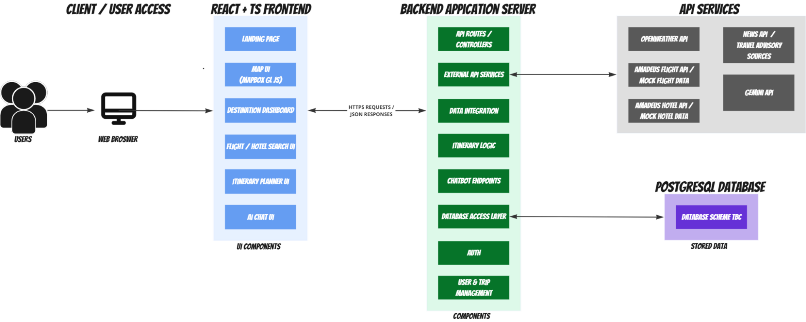
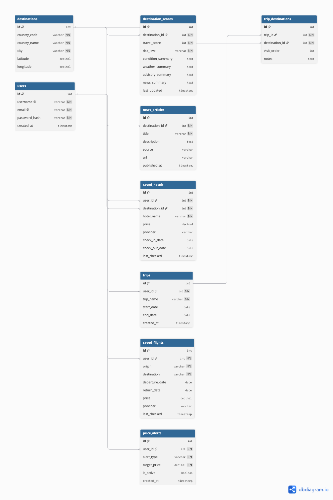
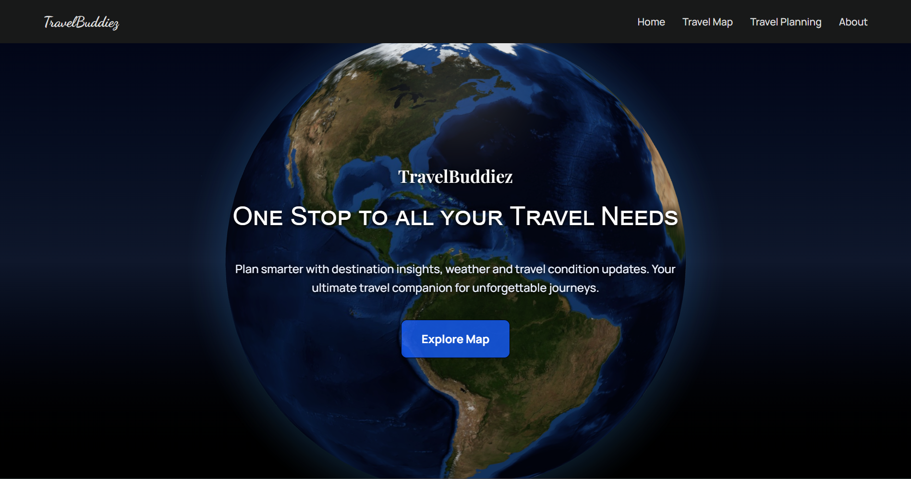
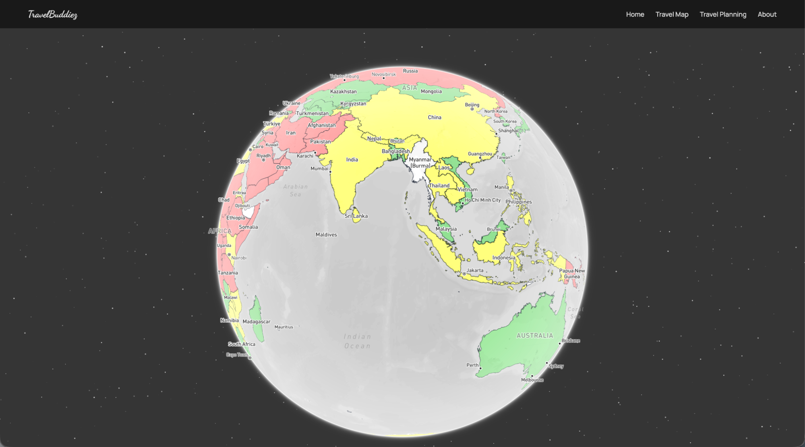
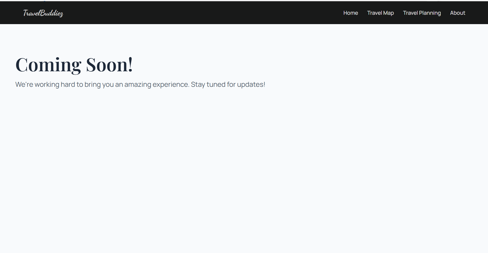
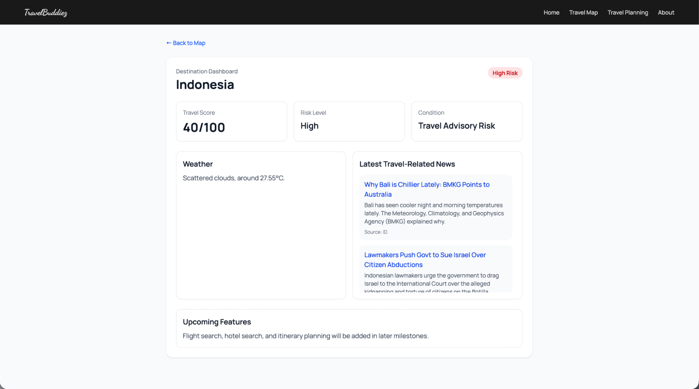
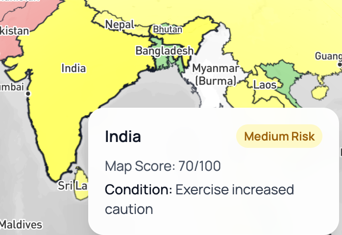

# TravelBuddiez
### One Stop to all your Travel Needs

Team Name: TravelBuddiez
Team ID: 6821
Target Level of Achievement: Apollo 11

Link to web application: https://travelbuddiez.vercel.app/

## Table of Contents
## Table of Contents

<ul>
  <li><a href="#description">Description</a></li>
  <li><a href="#motivation">Motivation</a></li>
  <li><a href="#aim">Aim</a></li>
  <li><a href="#target-level-of-achievement">Target Level of Achievement</a></li>
  <li><a href="#user-stories-current-milestone-1">User Stories (Current Milestone 1)</a></li>
  <li><a href="#user-stories-future">User Stories (Future)</a></li>

  <li><a href="#features">Features</a></li>
  <ul>
    <li><a href="#feature-1-core-interactive-map-based-travel-explorer">Feature 1 (core): Interactive Map-Based Travel Explorer</a></li>
    <li><a href="#feature-2-core-travel-condition-dashboard">Feature 2 (core): Travel Condition Dashboard</a></li>
    <li><a href="#feature-3-core-nlp-powered-travel-intelligence-dashboard">Feature 3 (core): NLP-Powered Travel Intelligence Dashboard</a></li>
    <li><a href="#feature-4-core-flight-price-monitoring-and-alerts">Feature 4 (core): Flight Price Monitoring and Alerts</a></li>
    <li><a href="#feature-5-extension-user-accounts-and-destination-tracking">Feature 5 (extension): User Accounts and Destination Tracking</a></li>
    <li><a href="#feature-6-extension-ai-travel-assistant">Feature 6 (extension): AI Travel Assistant</a></li>
    <li><a href="#feature-7-extension-trip-plan-export-and-sharing">Feature 7 (extension): Trip Plan Export and Sharing</a></li>
  </ul>

  <li><a href="#current-project-scope">Current Project Scope</a></li>

  <li><a href="#tech-stack">Tech Stack</a></li>
  <ul>
    <li><a href="#frontend">Frontend</a></li>
    <li><a href="#backend">Backend</a></li>
    <li><a href="#data-sources-and-api-usage">Data Sources and API Usage</a></li>
    <li><a href="#deployment">Deployment</a></li>
    <li><a href="#planned-future-infrastructure">Planned Future Infrastructure</a></li>
  </ul>

  <li><a href="#system-architecture">System Architecture</a></li>
  <li><a href="#database-schema-subjected-to-changes">Database Schema (Subjected to Changes)</a></li>

  <li><a href="#frontend-implementation">Frontend Implementation</a></li>
  <ul>
    <li><a href="#landingpage">LandingPage</a></li>
    <li><a href="#exploremappage">ExploreMapPage</a></li>
    <li><a href="#comingsoonpage">ComingSoonPage</a></li>
    <li><a href="#destinationdashboardpage">DestinationDashboardPage</a></li>
  </ul>

  <li><a href="#frontend-components">Frontend Components</a></li>
  <ul>
    <li><a href="#navbar">Navbar</a></li>
    <li><a href="#globebackground">GlobeBackground</a></li>
    <li><a href="#mapview">MapView</a></li>
    <li><a href="#countrytooltip">CountryTooltip</a></li>
  </ul>

  <li><a href="#backend-implementation">Backend Implementation</a></li>
  <ul>
    <li><a href="#api-route-layer">API Route Layer</a></li>
    <li><a href="#service-layer">Service Layer</a></li>
    <li><a href="#travel-score-calculation">Travel Score Calculation</a></li>
    <li><a href="#error-handling">Error Handling</a></li>
  </ul>

  <li><a href="#database-and-caching-plan">Database and Caching Plan</a></li>
</ul>

## Description
TravelBuddiez is a travel planning web application that helps users make safe and more informed travel decisions. The current Milestone 1 version focuses on an interactive travel map and a destination dashboard that displays destination-specific travel information such as weather conditions, travel-related news, advisory information, risk level, and a calculated travel score.

## Motivation
As frequent travellers, we wanted a platform that could make travel planning more seamless and reliable. Although there are already many travel applications and websites available, most of them only solve one part of the problem. Some platforms focus on booking and price comparison, while others provide travel advisories, weather updates, or destination information. This means users often must jump between multiple platforms just to properly plan a single trip.
We also realised that travel planning is no longer just about finding the cheapest prices. In today’s world, social conflicts, political unrest, and natural disasters can happen unexpectedly, and these events may affect a destination’s safety even after a trip has already been booked. As a result, travellers may make decisions based only on price without understanding the actual situation on the ground.
This highlights a gap in the current travel planning experience. While there are existing platforms that provide booking comparisons and others that provide travel-related advisories or updates, there are fewer solutions that combine these features into an all-in-one user-friendly platform.

## Aim
We aim to address this gap by creating an all-in-one travel planner that combines itinerary planning, map integration, price comparison, and live updates on weather and current affairs. By bringing these features together into one platform, we hope to help users plan trips that are not only affordable and convenient, but also safer and more informed.

## Target Level of Achievement
We are targeting **Apollo 11**. We plan to develop a system with multiple integrated features, a modular frontend-backend architecture, and external data integration, documented design decisions, version control practices, and future testing.

Our planned features include:
Interactive map-based travel explorer
NLP-powered travel intelligence dashboard
Travel condition dashboard
Flight price monitoring and alerts
User accounts and destination tracking
AI travel assistant
Trip plan export and sharing

## User Stories (current Milestone 1)
As a traveller, I want to view destinations on an interactive map so that I can better understand different travel locations visually.
As a traveller, I want to hover over supported countries so that I can quickly see basic travel information such as score and risk level.
As a traveller, I want to click on a supported destination so that I can view a more detailed destination dashboard.
As a traveller, I want to see weather updates for a selected destination so that I can understand current weather conditions.
As a traveller, I want to see travel-related news and advisory information so that I can identify possible travel risks.
As a traveller, I want to receive a simple travel score and risk summary so that I can make a more informed decision.
As a first-time user, I want the application interface to be clear and attractive so that I can use it without confusion.

## User Stories (future)
As a traveller, I want to create an account and log in, so that I can save and manage my trips.
As a traveller, I want to create a new trip plan, so that I can organize my journey in one place.
As a traveller, I want to add destinations and itinerary items, so that I can plan my travel schedule clearly.
As a traveller, I want to compare prices from different booking websites, so that I can choose the most affordable option.
As a traveller, I want to receive notifications when prices drop, so that I can book at the best time.
As a traveller, I want to chat with an AI assistant, so that I can get help with planning my trip.
As a traveller, I want to import and export my itinerary, so that I can easily share or save my plans.
As a budget-conscious traveller, I want to track my expected travel costs, so that I can stay within the budget.
As a traveller, I want to save shortlisted hotels and flights, so that I can compare them later.
As a traveller, I want to edit or delete trip details anytime, so that my plan stays updated.
As a first-time user, I want the app to have a clear and attractive interface, so that I can use it easily without confusion.

## Features
### Feature 1 (core): Interactive Map-Based Travel Explorer 
The interactive map allows users to explore countries visually. Countries are represented using polygon data and styled based on travel-related scores. When users hover over supported countries, a tooltip displays basic information such as country name, travel score, risk level, and travel condition. When users click a supported country, they are redirected to a destination dashboard for more detailed information.

**Current implementation:**
Implemented using Mapbox GL JS.
Loads country polygons from a GeoJSON file.
Uses country codes to match map polygons with supported destination data.
Displays map coloring for supported countries.
Displays a tooltip on hover.
Redirects users to the destination dashboard when a supported country is clicked.
Uses mock/advisory-based map data for the map tooltip and polygon coloring to avoid unnecessary API calls on map hover.

**Future implementation:**
Replace mock/advisory-only map scores with cached travel scores from the backend/database.
Load map scores from a lightweight backend endpoint such as `/api/map-scores`.
Ensure that the map and dashboard use the same travel score source.
Add more countries and eventually support broader country-level coverage.
Improve map styling and add filters such as safest destinations, weather risk, or advisory risk.

### Feature 2 (core): Travel Condition Dashboard
The destination dashboard displays detailed information for a selected destination. It provides a clearer breakdown of the selected country’s travel condition, including weather, news, advisory information, risk level, and a calculated travel score.

**Current implementation:**
Implemented as a frontend page using React Router.
Read the selected country code from the URL.
Calls the backend to fetch destination information.
Displays weather information from OpenWeather API.
Displays travel-related news from WorldNewsAPI.
Displays advisory information from a US travel advisory RSS source and temporary mock advisory data.
Calculates a travel score using weather, news, and advisory signals.
Shows loading and error states.

**Future implementation:**
Store processed destination data in a database.
Read cached destination summaries before deciding whether to call external sources again.
Add score breakdowns to explain how weather, news, and advisory data affected the final travel score.
Add more robust NLP-based summarisation and classification.
Support historical comparisons and trend changes over time.

### Feature 3 (core): NLP-Powered Travel Intelligence Dashboard
This feature analyses travel-related articles, advisories, and weather descriptions to identify possible travel risks. The long-term goal is to use NLP techniques such as text embeddings, vector similarity search, keyword extraction, and summarisation to group and retrieve destination-relevant information.

**Current implementation:**
Uses a simple keyword-based analysis approach on weather and news text.
Checks for risk-related words such as storm, flood, earthquake, protest, airport disruption, and similar travel-related warning terms.
Uses these signals as part of the travel score calculation.

**Future implementation:**
Implement proper NLP classification for destination-related risks.
Store article embeddings using pgvector.
Use vector similarity search to retrieve articles most relevant to a selected destination.
Generate concise summaries of risk factors for users.
Distinguish between different risk categories such as weather, safety, transport disruption, health, and political unrest.

### Feature 4 (core): Flight Price Monitoring and Alerts
Users can track flight prices between selected locations and set alerts when prices fall below a specified threshold. The system will notify users when favourable pricing opportunities arise.

**Current implementation:**
Not implemented in Milestone 1.

**Future implementation:**
To be determined.

### Feature 5 (extension): User Accounts and Destination Tracking
Users can create accounts to save preferred destinations, monitor price alerts, and store travel plans for future reference.

**Current implementation:**
Not implemented in Milestone 1.

**Future implementation:**
To be determined.

### Feature 6 (extension): AI Travel Assistant
An AI chatbot will allow users to ask questions and receive travel recommendations based on aggregated travel data, including weather conditions, price trends, and NLP-generated insights.

**Current implementation:**
Not implemented in Milestone 1.

**Future implementation:**
To be determined.

### Feature 7 (extension): Trip Plan Export and Sharing 
Users will be able to export travel plans and itinerary summaries in formats such as PDF or shareable links.

**Current implementation:**
Not implemented in Milestone 1.

**Future implementation:**
To be determined.

## Current Project Scope
Milestone 1 focuses on proving that the main technical direction is feasible. The application currently demonstrates:

- A React + TypeScript frontend.
- A FastAPI backend.
- Frontend-backend communication through JSON API responses.
- External weather data integration using OpenWeather API.
- External news data integration using WorldNewsAPI.
- Travel advisory integration using a US travel advisory RSS feed and temporary mock advisory data.
- A Mapbox-based interactive travel map.
- Country tooltip and map coloring for supported countries.
- A destination dashboard that displays weather, news, advisory information, risk level, and travel score.
- Basic keyword-based text analysis for travel-related risks.

At this stage, **no database has been implemented yet**. Map coloring and tooltip data currently use lightweight US advisory-based data, while the destination dashboard performs backend API calls and calculates a fuller travel score using available weather, news, and advisory signals.

This separation is intentional for Milestone 1 because the map should remain fast and should not trigger external API calls whenever the user hovers over a country. In later milestones, both the map and dashboard will be connected to the same cached travel score system.

## Tech Stack
### Frontend
React:
Used to build the main frontend interface using reusable components such as the Navbar, Travel Map, Country Tooltip, and page layouts

React DOM:
Renders the React application into the browser DOM

Typescript:
Adds type safety to the frontend code, especially for destination data, country codes, travel scores, risk levels, and component props

Vite:
Used as the frontend development and build tool, providing a fast development server and production build process

Tailwind CSS:
Used for styling, spacing, layout, responsiveness, colours, hover effects, and overall UI design directly inside the component files

React Router DOM:
Handles navigation between pages such as Home, Travel Map, Travel Planning, and About without refreshing the page

Mapbox GL JS:
Used to display and control the interactive world map, including country layers, map styling, hover effects, and selected country data

React Globe GL:
Used to create a 3D globe-style background for the Home page

Motion:
Used to add animations and transitions, such as the loading animation, tooltip animations, and smooth UI effects

React Icons:
Icons to use for interface design or animations

### Backend
FastAPI:
Creates backend API routes that can be accessed by the React frontend. FastAPI handles HTTP requests from the frontend and returns the destination data in JSON format

Python:
Main backend programming language. Python is used to write the backend logic, API routes, data processing functions, and calculation of travel score

Uvicorn:
Runs the FastAPI development server locally. It allows the backend API to be tested during development

Requests / HTTPX:
Used to send HTTP requests from the backend to external APIs, such as weather and news APIs. These allow the backend to retrieve live weather and news data

JSON:
Used as the main data format for communication between the backend and frontend. The backend returns structured destination data including country, city, weather summary, news summary, travel score, risk level, condition, and advisory

CORS Middleware:
Used to allow the React frontend to communicate with FastAPI backend, especially when the frontend and backend are running on different local ports or deployed separately.

### Data Sources and API Usage

OpenWeather API:
OpenWeather API is used to retrieve current weather information for selected destinations. The backend processes this data to produce weather summaries and identify possible weather-related risks such as storms, heavy rain, or extreme conditions.

WorldNewsAPI:
WorldNewsAPI is used to retrieve recent news articles related to selected destinations. The backend checks article titles, summaries, and text for travel-related risk signals such as natural disasters, airport disruptions, political unrest, and severe weather events.

US Travel Advisory RSS Feed:
The US travel advisory source is used through an RSS feed. Although RSS is not the same as a typical REST API endpoint, it is still an external machine-readable data source that the backend can fetch and process. For documentation, we describe it as an **external advisory RSS feed** rather than a normal API.

Mock Advisory Data:
Mock advisory data is currently used as a temporary fallback because a complete and reliable advisory API has not yet been selected. This allows us to continue building and testing the frontend-backend flow while keeping the system modular enough to replace the mock data with a real source later.

### Deployment
Vercel (Frontend):
Hosts the React and Vite application and provides a public URL for users to access the website. When changes are pushed to the GitHub repository, Vercel can automatically rebuild and redeploy the frontend.

Render (Backend): 
Render hosts the FastAPI server and provides a public API URL for the frontend to send requests to. Environment variables such as API keys are stored securely in Render instead of being written directly in the codebase. The frontend uses the deployed backend URL to fetch destination data from the FastAPI API.

GitHub:
Used to store the project repository and connect the codebase to Vercel and Render for deployment

### Planned Future Infrastructure
PostgreSQL / Supabase: 
Store users, trips, cached travel scores, destination summaries, saved destinations, flights, hotels and alerts.

pgvector: 
Store embeddings for destination-related articles and support similarity search.

JWT Auth: 
Support secure login.

Celery + Redis or scheduled jobs: 
Refresh cached travel scores and price alerts periodically.

Resend or email services: 
Send price-drop alerts and travel-related notifications.

React-pdf: 
Export itineraries and summaries and PDF files.

Gemini API / similar: 
Powers the AI travel assistant and itinerary recommendation features.

## System Architecture

TravelBuddiez uses a client-user architecture, where the frontend is responsible for displaying the user interface and interactive map, while the backend handles data requests and returns destination information

## Database Schema (Subjected to Changes)

## Frontend Implementation
### LandingPage

This is the landing page of TravelBuddiez. It introduces the application with the project name, tagline, short description, and an “Explore Map” button that navigates users to the Travel Map page. 

Uses `GlobalBackground` to create a travel-themed background
Uses `useState` and `useEffect` to control a short loading screen, and the auto-rotation of the globe
Uses `motion/react` and `AnimatePresence` to animate the loading screen, fade effects, and plane icon movement
Uses `useNavigate` from React Router to redirect users to `/map` when the “Explore Map” button is clicked

### ExploreMapPage

This is the Travel Map page, which is currently the main interactive feature of the application. It acts as the page container for the map feature and renders the `MapView.tsx` component, where the main map logic is handled

Uses `MapView.tsx` to display the interactive travel map
Keeps the page file simple by separating the actual map logic into the `MapView.tsx` component

### ComingSoonPage

The `ComingSoon` page is used as a temporary placeholder for pages that have not been fully implemented yet. In this current version of TravelBuddiez, the Travel Planning and About pages are still under development. 
Since the Navbar already includes links to these pages, users who click on them will be redirected to the `ComingSoon` page, informing users that the page is still under development

### DestinationDashboardPage

This page displays detailed travel information for a selected destination. When a user clicks on a supported country from the travel map, they are redirected to the dashboard page using the country code in the URL.

Uses `useParams()` to read the selected country code from the URL
Uses `getDestinationByCountryCode()` to fetch destination data from the backend API
Uses `useState` to store the destination data, loading state, and error message
Uses `useEffect` to fetch data when the page loads or when the country code changes
Displays a dashboard containing the destination name, travel score, risk level, condition, weather, and travel-related news
Uses `getRiskBadgeClass()` to apply different badge colours based on the risk level
Displays travel-related news articles with title, description, source, and clickable article links
Provides a “Back to Map” link so users can return to the interactive map

## Frontend Components
### Navbar

This component provides the main navigation for TravelBuddiez. It appears at the top of the website and allows users to move between different pages.

Displays the TravelBuddiez logo
Uses `Link` component of React Router to navigate between pages without refreshing the browser
Provides navigation links to Home, Travel Map, Travel Planning, and About pages.

### GlobeBackground
This component creates the animated 3D globe background used on the Home page. External image URLs are also used for the globe texture and bump map:
‘’’
globeImageUrl="https://unpkg.com/three-globe/example/img/earth-blue-marble.jpg"
bumpImageUrl= “https://unpkg.com/three-globe/example/img/earth-topology.png”
‘’’

Uses `react-globe-gl` to render a 3D Earth model
Uses `useRef` to store a reference to the globe instance
Uses `useEffect	 to configure the globe after it loads, including its initial camera position, auto-rotation, rotation speed, and zoom settings

### MapView
This component contains the main logic for displaying and interacting with the travel map. For this current version of TravelBuddiez, mock destination data is used for the map colouring to reduce unnecessary external API calls. Database storage will be implemented in future milestones to cache destination data. The map will use the cached from the database to colour each country based on its saved travel score. 
Backend API calls will only be triggered when the user clicks on a specific country to view more detailed information. This approach improves loading speed, reduces repeated external API usage, and allows the map to show basic destination information without needing to fetch live data every time the map loads.

Uses Mapbox GL JS to render an interactive world map
Loads country polygon data from `/countries.geojson`
Uses `promoteID` to allow Mapbox feature-state hover styling
`getColor()` function converts travel scores into map colours
Uses `useRef` to store the map instance, map container, and hovered country ID
Uses `useEffect` to initialise the map and clean it when the tooltip component unmounts
Displays `CountryTooltip` when a supported country is hovered
Uses `useNavigate` to redirect users to the `DestinationDashboardPage` when a country is clicked

### CountryTooltip

This component displays a small information card when the user hovers over a supported country on the map. The tooltip shows basic travel information, including the country name, travel score, risk level, and travel condition.
In this current version, the tooltip displays information from mock destination data. In future milestones, the tooltip can use cached destination data from the database, such as the latest saved travel score, condition, and risk level, reducing the number of live external API calls. 

Receives destination, x, and y values as props from `MapView`
Positions the tooltip near the user’s cursor based on x and y values
Uses `getRiskBadgeClass()` function to apply different colours and style the risk badge based on risk level 
Uses `motion/react` to animate the tooltip appearance and disappearance

## Backend Implementation
The backend is built using FastAPI and Python. It acts as the bridge between the frontend and the external data sources.

### API Route Layer
The backend exposes routes that the frontend can call to retrieve destination information. The frontend does not call OpenWeather API, WorldNewsAPI, or advisory sources directly. Instead, the frontend calls the FastAPI backend, and the backend returns processed JSON responses.

### Service Layer
The backend separates external data retrieval into service files. This keeps the code easier to maintain and makes it simpler to replace or upgrade data sources later.

Current service responsibilities include:

- Fetching weather information.
- Fetching destination-related news.
- Fetching or reading advisory information.
- Combining the returned data into a destination response.
- Calculating travel score and risk level.

### Travel Score Calculation
The current backend travel score uses available signals from:
- Weather conditions from OpenWeather API.
- News article content from WorldNewsAPI.
- Advisory information from RSS/mock advisory data.

The score is then returned to the frontend together with the destination summary.

### Error Handling
The backend includes basic error handling so that the frontend can display fallback messages when destination data is unavailable or when external data retrieval fails.

## Database and Caching Plan
A database has not been implemented in Milestone 1. However, database storage is an important part of the future design.

**Why a Database Is Needed** 
Without a database, the backend may need to call external APIs repeatedly. This can make the application slower and may hit API rate limits. A database allows the system to store processed destination data and reuse it until it becomes outdated.

**Planned Cached Data Flow** 

Scheduled refresh or user request 
↓ 
Backend fetches weather, news, and advisory data 
↓ 
Backend calculates travel score 
↓ 
Backend stores result in database 
↓ 
Map and dashboard read cached result

**Planned Refresh Strategy** 
A simple future refresh strategy is:
- Weather data: refresh every few hours.
- News data: refresh every 6-12 hours.
- Advisory data: refresh every 24 hours.
- Travel score: recalculate whenever the underlying data is refreshed.

For the early implementation, the backend can use a simpler “check cache first, refresh if stale” approach. This means the backend returns cached data if it is still fresh, and only calls external sources again when the stored data is missing or outdated.
